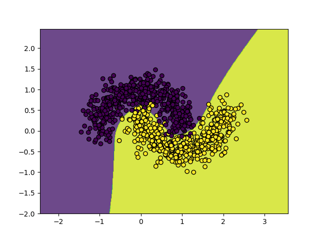
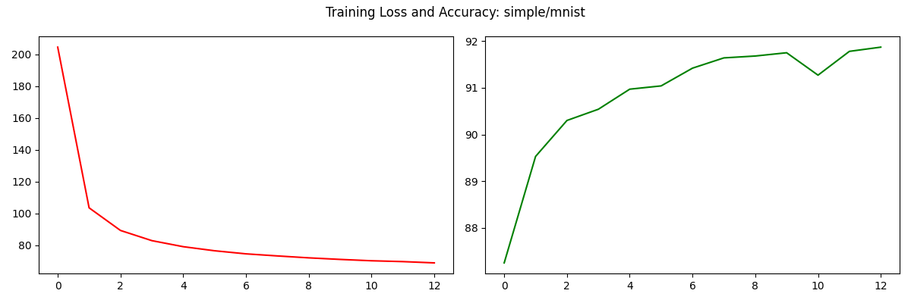
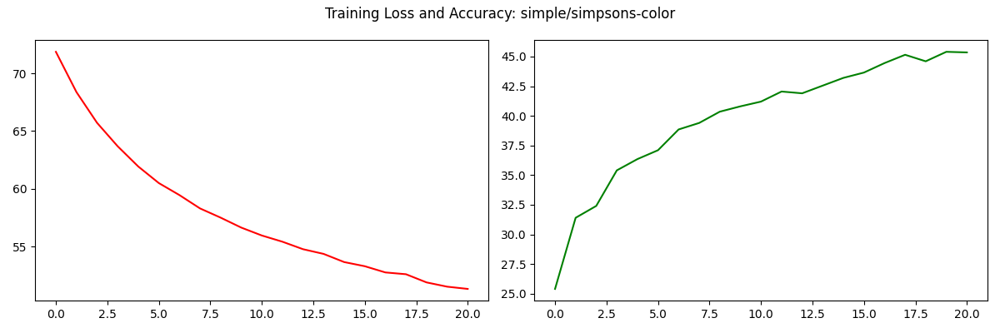
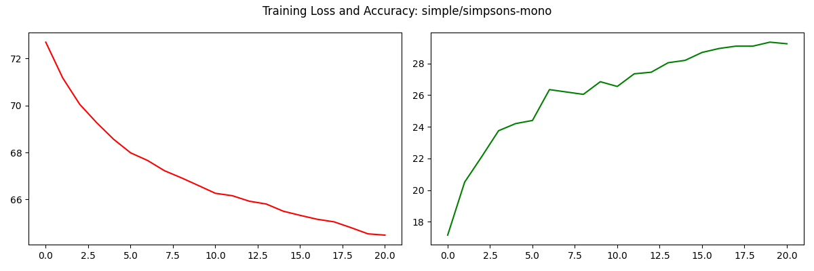
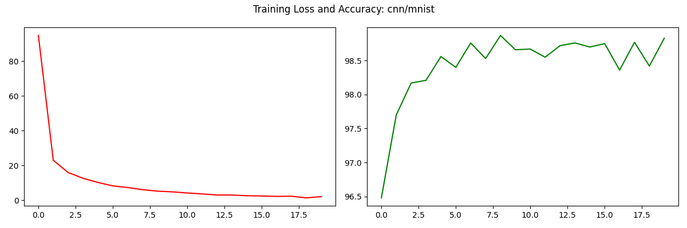
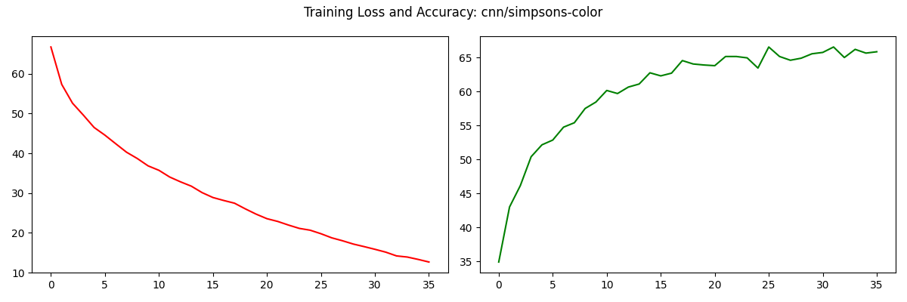
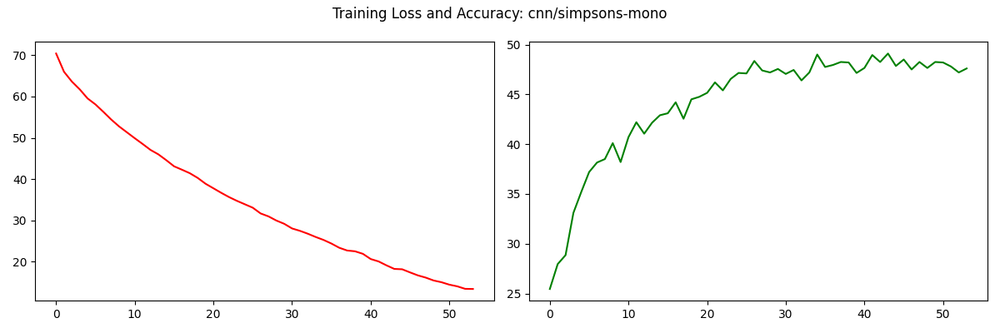
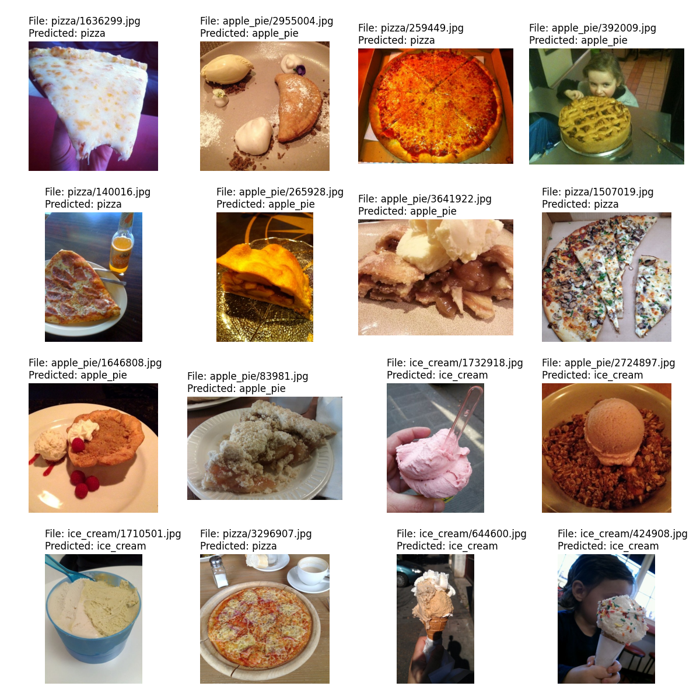
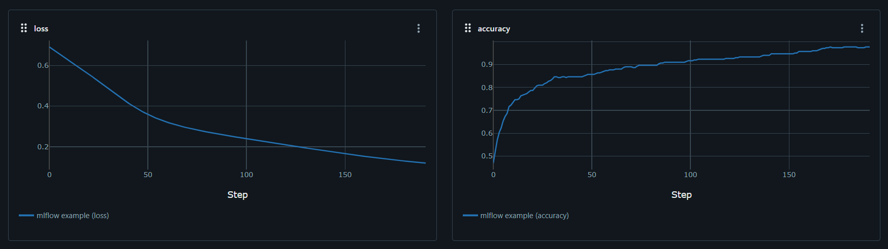
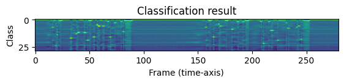

# 01 - Binary Classification

# 02 - Multi Class Classification

# 03 - Vision Classification - Simple
mnist

simpsons-color

simpsons-mono

# 03 - Vision Classification - CNN
mnist

simpsons-color

simpsons-mono

# 04 - Transfer Learning - ResNet

# 05 - MLFlow

# 06 - ASR
[audio](readme/figure_06-audio.ogg)

"i'm fully connected i can see everything"

# 07 - Question Answering

## BERT Wikipedia Page

#### BERT is a?
*a language model based on the transformer architecture* [score=0.1594]
> ...s from Transformers (BERT) is **a language model based on the transformer architecture**, notable for its dramatic imp...

#### How many modules BERT has?
*three* [score=0.5598]
> ... high level, BERT consists of **three** modules:  The decoder module ...

#### Is BERT fine-tuned?
*BERT can be fine-tuned* [score=0.1495]
> ...ne-tuning After pre-training, **BERT can be fine-tuned** with fewer resources on small...

#### Who published BERT?
*Google* [score=0.8099]
> ...T was originally published by **Google** researchers Jacob Devlin, Min...

#### When was BERT published?
*2019* [score=0.9765]
> ...anding tasks:  Analysis As of **2019**, the reasons for BERT's state...

## Shape of Things by Ray Bradbury

#### Who is Peter?
*Peter Horn* [score=0.8104]
> ...re any chance of that?" cried **Peter Horn**. "No, none!" The power scream...

#### When we'll have some results?
*by the end of the year* [score=0.5247]
> ...uld have some results for you **by the end of the year**. I don't want to say anything...

#### What year is it?
*1969* [score=0.9523]
> ... good. The New Year, the year **1969**, arrived. Rocket ships flashe...

#### Who looks dangerous?
*Py* [score=0.9311]
> ... about that." "And what about **Py**? When we come into his strata...
