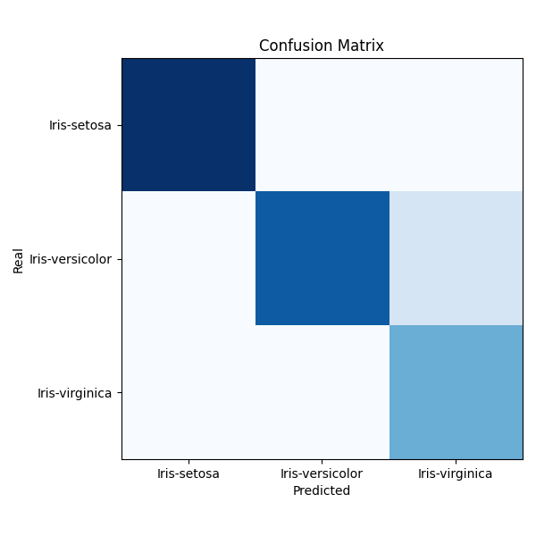

# 01 - Binary Classification

# 02 - Multi Class Classification

# 03 - Vision Classification - Simple
mnist

simpsons-color

simpsons-mono

# 03 - Vision Classification - CNN
mnist

simpsons-color

simpsons-mono

# 04 - Transfer Learning - ResNet

# 05 - MLFlow

